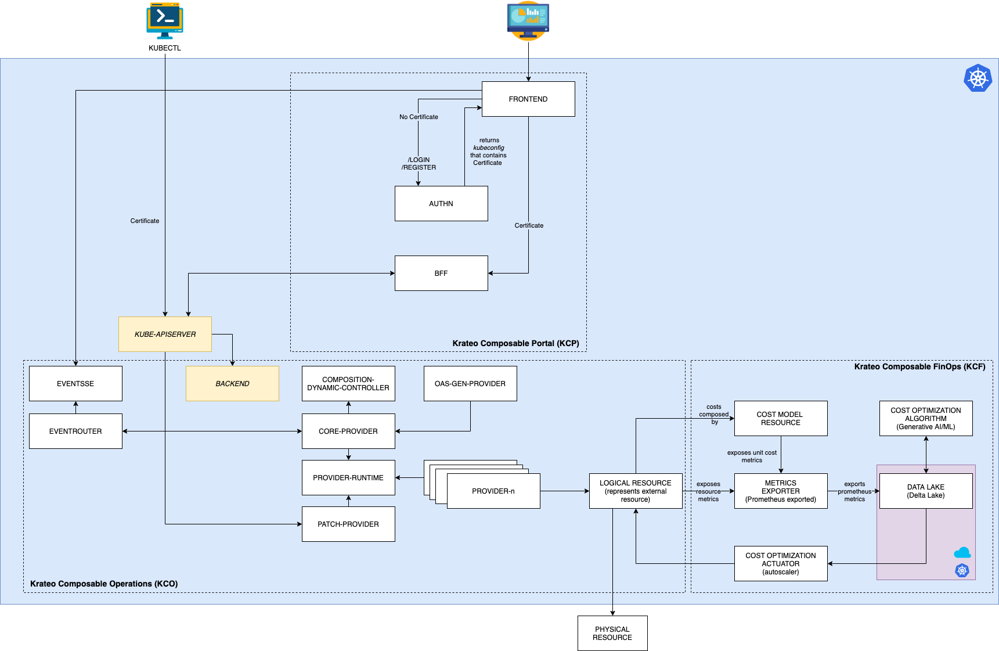

# What is Krateo PlatformOps?

**Krateo Platformops** is an open source platform that gives users the capability to create any desired resource on basically any infrastructure they'd like. Be it a K8s cluster, microservice, application, pipeline, database or anything else, Krateo has got your back. The only requirement is for the resource to be descriptible via a YAML file representing the resource's _desired state_ (rings a bell? 😉).

Krateo allows for:

- **Creating any kind of resources within and outside the Kubernetes cluster it runs on**: whilst Krateo runs as a Deployment in a Kubernetes cluster, it can also create resources _outside_ the cluster. You can use Krateo to create anything from new Kubernetes clusters, Logstash pipelines, Docker registries, API gateways, and many others.
- **Focusing on the management of services**: Krateo frees the user from most of the burden of cluster management, giving them the ability to entirely focus on the services that must be run. This results a phenomenal user experience that drastically reduces wastes of time.
- **Single-handedly monitoring and controlling resources**: Krateo also acts as a centralized control plane, letting users monitor anything ranging from CI/CD pipelines to pod statuses and open tickets on your JIRA. All the information you need is present on a single page -- you'll never have to guess the correct dashboard ever again.

:::info
Join the Krateo Community [Discord server](https://discord.gg/sjca4QvVTa)!
:::

## Architecture

Architecture is based on these principles:
* Any component of Krateo must be configured declaratively
* The only APIs that implement business logic are those exposed by the Kubernetes api server
* Any operation carried out via the portal must also be possible from the Kubernetes CLI (_kubectl_)
* Authentication is completely delegated to the Kubernetes server API
* Authorization is completely delegated to the Kubernetes RBAC
* Krateo uses Kubernetes Custom Resources (and therefore the control plane etcd) as a database
* Krateo does not use volumes

## Requirements

* A certified Kubernetes distribution
* Kubernetes minimal requirements:
  * 6vCPUs and 12GiB RAM – no storage required
  * Ability to expose service of type LoadBalancer (https://kubernetes.io/docs/tasks/access-application-cluster/create-external-load-balancer/)
  * Networking requirements
    * Ability to reach https://github.com , https://charts.krateo.io , ghcr.io, docker.io

## Installation

Krateo PlatformOps provides a Helm chart to install Krateo PlatformOps:
* Krateo PlatformOps Operator: https://github.com/krateoplatformops/installer-chart

:::caution
Krateo PlatformOps Operator is undergoing active development, wait for GA release (`v2.x.x`)!
:::

## Next Steps

To learn more about Krateo PlatformOps, consider checking out our key concepts or get hands-on right away with our
[quickstart](./quickstart)!
