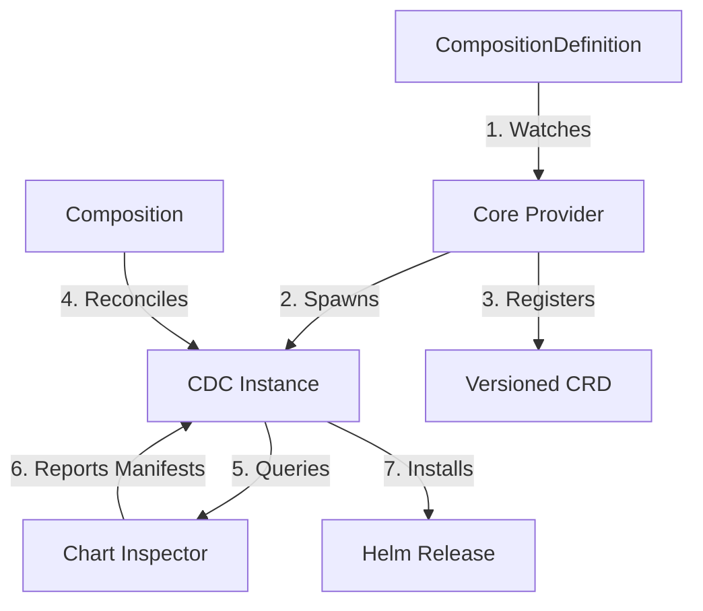

# Composition Dynamic Controller (CDC)

The **Composition Dynamic Controller (CDC)** is the execution engine of Krateo. It is a specialized operator, instantiated by the [Core Provider](10-core-provider.md), that manages the full lifecycle of Helm-based services.

## The Chain of Command

To understand Krateo, it's essential to visualize the relationship between its core components:

1.  **Core Provider** (The Manager): Watches for `CompositionDefinition` resources. When one is created, it generates a CRD and spawns a dedicated **CDC** instance.
2.  **CDC** (The Worker): Watches for `Composition` resources (instances of the generated CRD).
3.  **Chart Inspector** (The Safety Officer): Queried by the CDC to perform dry-runs of Helm charts, enabling precise RBAC generation and safety checks.

---

## Blueprint vs. Instance

Krateo separates the *definition* of a service from its *actual usage*.

| Concept | Resource | Purpose | analogy |
| :--- | :--- | :--- | :--- |
| **Blueprint** | `CompositionDefinition` | Defines *what* a service is (Helm chart, version, API group). | The Class / Architect's Plan |
| **Instance** | `Composition` | A specific, live deployment of that service with custom values. | The Object / The actual House |

---

## Documentation

| Document | Purpose |
| :--- | :--- |
| [Workflow & Safety](21-cdc-workflow.md) | Deep dive into Chart Inspector integration and RBAC auto-provisioning. |
| [Values Injection & Pausing](22-cdc-values-injection.md) | How Krateo injects metadata into charts and manages graceful pausing. |
| [Release Naming](23-cdc-release-names.md) | Understanding how Helm release names are generated. |
| [Telemetry](51-telemetry-cdc.md) | Metrics reference for CDC and unstructured-runtime. |

---

## Technical Reference

### Environment Variables

The CDC can be configured via environment variables in its Deployment. Many of these are automatically set by the Core Provider when it spawns the CDC instance.

| Name | Description | Default | Notes |
| :--- | :--- | :--- | :--- |
| **Operational** | | | |
| `COMPOSITION_CONTROLLER_DEBUG` | Enables verbose debug output. | `false` | |
| `COMPOSITION_CONTROLLER_WORKERS` | Number of concurrent reconciliation workers. | `1` | |
| `COMPOSITION_CONTROLLER_RESYNC_INTERVAL`| How often to force a resync of all resources. | `3m` | |
| `KRATEO_NAMESPACE` | Namespace where Krateo is installed. | `krateo-system` | |
| `URL_CHART_INSPECTOR` | Endpoint for the Chart Inspector service. | `http://chart-inspector...:8081/` | |
| **Resource Scope** (Auto-populated) | | | |
| `COMPOSITION_CONTROLLER_GROUP` | API Group of the resource to manage. | - | Set by Core Provider |
| `COMPOSITION_CONTROLLER_VERSION` | API Version of the resource to manage. | - | Set by Core Provider |
| `COMPOSITION_CONTROLLER_RESOURCE` | Plural name of the resource to manage. | - | Set by Core Provider |
| `COMPOSITION_CONTROLLER_SA_NAME` | ServiceAccount name for the CDC pod. | - | Set by Core Provider |
| `COMPOSITION_CONTROLLER_SA_NAMESPACE`| ServiceAccount namespace for the CDC pod. | - | Set by Core Provider |
| **Helm Management** | | | |
| `HELM_MAX_HISTORY` | Number of Helm release versions to keep. | `3` | |
| `COMPOSITION_CONTROLLER_SAFE_RELEASE_NAME`| Appends UID suffix to release names. | `true` | Highly recommended |
| **Retry Logic** | | | |
| `COMPOSITION_CONTROLLER_MAX_ERROR_RETRIES`| Maximum number of retries on failure. | `5` | Set to 0 to disable |
| `COMPOSITION_CONTROLLER_MIN_ERROR_RETRY_INTERVAL`| Minimum interval between retries. | `1s` | |
| `COMPOSITION_CONTROLLER_MAX_ERROR_RETRY_INTERVAL`| Maximum interval between retries. | `60s` | |
| **Observability (OTEL)** | | | |
| `OTEL_ENABLED` | Enables OpenTelemetry metrics export. | `false` | |
| `OTEL_EXPORT_INTERVAL` | Interval used to export OTLP metrics. | `30s` | |
| `OTEL_EXPORTER_OTLP_ENDPOINT` | OTLP endpoint for metrics export. | `` | |
| `COMPOSITION_CONTROLLER_METRICS_SERVER_PORT`| Port for the internal metrics server. | - | Disabled if not set |
