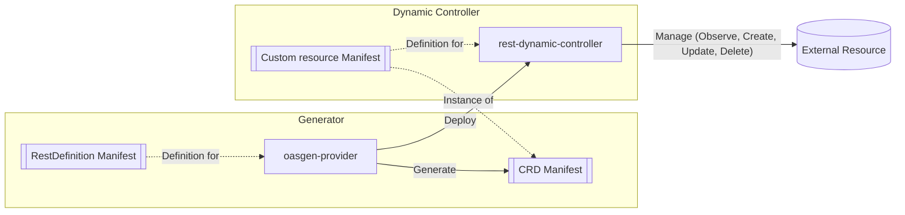
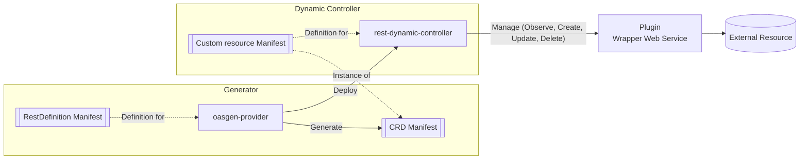
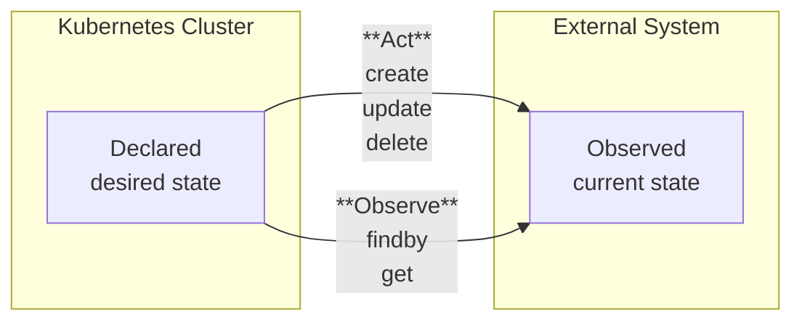

# Krateo OASGen Provider

The Krateo OASGen Provider is a Kubernetes controller that generates Custom Resource Definitions (CRDs) and controllers to manage resources directly from OpenAPI Specification (OAS) 3.0/3.1 documents.
It enables seamless integration of API-defined resources into Kubernetes environments without the need to write custom operators.

## Summary

- [Requirements](#requirements)
- [How to Install](#how-to-install)
- [Glossary](#glossary)
- [Why OASGen Provider?](#why-oasgen-provider)
  - [Key Advantages](#key-advantages)
  - [Comparison with Traditional Operator approach](#comparison-with-traditional-operator-approach)
- [Architecture](#architecture)
  - [Standard scenario](#standard-scenario)
  - [Scenario with Plugin (Wrapper Web Service)](#scenario-with-plugin-wrapper-web-service)
- [Workflow](#workflow)
  - [Standard scenario](#standard-scenario-1)
  - [Scenario with Plugin (Wrapper Web Service)](#scenario-with-plugin-wrapper-web-service-1)
- [RestDefinition](#restdefinition)
  - [CRD Specification](#crd-specification)
  - [How to create a RestDefinition](#how-to-create-a-restdefinition)
  - [About Resource reconciliation and RestDefinition Actions](#about-resource-reconciliation-and-restdefinition-actions)
  - [Action `findby`](#action-findby)
  - [Action `get`](#action-get)
  - [Action `create`](#action-create)
  - [Action `update`](#action-update)
  - [Action `delete`](#action-delete)
  - [API Endpoints consistency requirements](#api-endpoints-consistency-requirements)
  - [Type-Safe Status Fields](#type-safe-status-fields)
- [Authentication](#authentication)
- [Configuration resources](#configuration-resources)
- [Usage guide](#usage-guide)
- [Environment Variables and Flags](#environment-variables-and-flags)
- [Security features](#security-features)
- [Best Practices](#best-practices)
- [Unsupported features](#unsupported-features)
- [OAS 3.0 vs OAS 3.1](#oas-30-vs-oas-31)

## Requirements

- Kubernetes cluster (v1.20+ recommended).
- OpenAPI Specification 3.0/3.1 documents for the APIs you want to manage. Please refer to the [Usage Guide section](./11-oasgen-provider-cheatsheet.md) for more details on the OAS document management.
- Network access to the API endpoints to be managed from within the Kubernetes cluster.

## How to Install

Install OASGen Provider by installing the related Helm chart:
```sh
helm repo add krateo https://charts.krateo.io
helm repo update
helm install oasgen-provider krateo/oasgen-provider --namespace krateo-system
```

## Glossary

| Term | Definition |
|------|------------|
| **CRD (Custom Resource Definition)** | A Kubernetes resource that defines custom objects and their schemas. |
| **CR (Custom Resource)** | An instance of a Custom Resource Definition (CRD) |
| **RestDefinition** | A Custom Resource managed by oasgen-provider that defines how API resources are managed in Kubernetes based on OAS specifications. |
| **RDC (Rest Dynamic Controller)** | A controller deployed by the oasgen-provider to manage Custom Resources representing external resources defined by a RestDefinition. |
| **OAS (OpenAPI Specification)** | A standard, language-agnostic interface description for REST APIs (https://www.openapis.org/). |
| **Resource CRD** | A Custom Resource Definition generated by oasgen-provider based on the OAS schema. |
| **External system / External APIs** | The service or API that we want to manage through Kubernetes resources. |
| **Resource reconciliation** | The process of ensuring that the state of resources in the external system matches the desired state defined in Kubernetes resources which is the source of truth. |
| **Plugin** | An **optional** wrapper web service to implement to maintain consistent API interfaces when needed. Can be also viewed as an **adapter pattern** / proxy service since it add a layer of indirection between the Rest Dynamic Controller and the external API. |

## Why OASGen Provider?

The **OASGen Provider** aims to reduce the complexity and effort required to manage external APIs in Kubernetes environments normally experienced with traditional custom operators.
Instead of writing and maintaining custom operators for each API, OASGen leverages the OAS definition to **automatically generate CRDs and controllers**, making **any OpenAPI-compliant API manageable as a first-class Kubernetes resource**.

### Key Advantages

1. **No operator boilerplate**  
   - Traditional operators require writing controllers, CRDs, RBACs, and more manually.  
   - OASGen eliminates this burden: from a single `RestDefinition` manifest pointing to an OAS file, it **generates CRDs and a controller** (`Rest Dynamic Controller`) ready to reconcile resources.

2. **OAS as the single source of truth**  
   - By consuming the OpenAPI Specification, OASGen ensures **type safety, schema validation, and consistency** directly from the API contract.  
   - Resource definitions in Kubernetes always match the schema of the underlying API.

3. **Pluggable architecture for inconsistent APIs**  
   - Not all APIs are consistent in their identifiers, response bodies, or field naming.  
   - OASGen supports **Plugins (Wrapper Web Services)** to normalize such APIs without changing the user experience in Kubernetes.

4. **Extensibility with zero-code changes**  
   - To add support for a new external API, you don’t need to write Go code or recompile anything.  
   - Just supply an OAS document and author a `RestDefinition`.  
   - OASGen takes care of generating the CRD and deploying the controller.

5. **Authentication and configuration management**  
   - OASGen automatically generates configuration CRDs that handle **authentication and configuration parameters**.  
   - Credentials are securely managed via Kubernetes secrets.

### Comparison with Traditional Operator approach

| Aspect | Traditional Operator | OASGen Provider |
|--------|----------------------|-----------------|
| **Development Effort** | Usually requires writing Go code, CRDs, RBAC, testing, and lifecycle management. | Zero code – generate CRDs/controllers directly from OAS + `RestDefinition`. |
| **Schema Definition** | Must be manually translated into Kubernetes CRDs. | Automatically inferred from OAS schema. |
| **Reconciliation Logic** | Custom-written per operator. | Generic, auto-generated reconciliation (create, update, delete, observe). |
| **Consistency with API** | High risk of schema drift if the API evolves. | Always matches OAS contract (type-safe CRDs + validation). |
| **Handling API Inconsistencies** | Requires patching code in the operator. | Use an optional Plugin (Wrapper Web Service) without modifying the core provider. |
| **Extensibility** | New APIs require new operators or significant code changes. | New APIs supported by simply adding a new `RestDefinition` with an OAS file. |
| **Security & Configuration** | Custom implementation per operator. | Auto-generated `*Configuration` CRDs integrated with Kubernetes secrets. |
| **Blast Radius on errors** | Bugs in custom code can lead to crashes or misbehavior. A bug for Resource A can affect Resources B, C and D if in the same operator. | Isolated controllers per `RestDefinition`. Bugs are contained; one faulty API does not affect others. Generic controllers with well-defined behavior; less custom code means fewer bugs. |

## Architecture

In the following diagrams, we illustrate the architecture and workflow of the OASGen Provider in two scenarios: a standard scenario and a scenario that includes an optional Plugin (Wrapper Web Service).

### Standard scenario


<br/>
The diagram illustrates how the OASGen Provider processes OpenAPI Specifications to generate CRDs and deploy the Rest Dynamic Controller (RDC). The RDC manages custom resources and interacts with external APIs.

### Scenario with Plugin (Wrapper Web Service)



<br/>
In this secondo scenario, very similar to the first one, the Rest Dynamic Controller interacts with an optional Plugin (Wrapper Web Service) to handle API calls. This is useful when the external API does not conform to the expected interface or requires additional processing.

## Workflow

### Standard scenario

1. User applies a RestDefinition CR.
2. `oasgen-provider` fetches the OAS specification.
3. `oasgen-provider` generates a CRD based on the OAS schema.
4. `oasgen-provider` deploys the specific Rest Dynamic Controller.
5. Rest Dynamic Controller manages custom resources according to API specifications.
6. Resources states are synchronized with external APIs (observe, create, update, delete).

### Scenario with Plugin (Wrapper Web Service)

1. User applies a RestDefinition CR.
2. `oasgen-provider` fetches the OAS specification.
3. `oasgen-provider` generates a CRD based on the OAS schema.
4. `oasgen-provider` deploys the specific Rest Dynamic Controller.
5. Rest Dynamic Controller manages custom resources according to API specifications.
6. Resources states are synchronized with external APIs (observe, create, update, delete) **through the Plugin (Wrapper Web Service) as an intermediary**.

## RestDefinition

The `RestDefinition` is the core Custom Resource Definition (CRD) used by the OASGen Provider to define how external API resources are managed in Kubernetes based on OpenAPI Specifications (OAS) 3.0/3.1 documents.
It allows to specify the location of the OAS file, the resource group for generated resources, and detailed mappings of CRUD operations to HTTP endpoints defined in the OAS.
In addition, it provides options to customize resource identification, status fields, and configuration parameters.
More information about the `RestDefinition` CRD and how to create one is provided below.

### CRD Specification

The RestDefinition CRD specification can be found here: [RestDefinition CRD](https://github.com/krateoplatformops/oasgen-provider/blob/main/crds/ogen.krateo.io_restdefinitions.yaml).

### How to create a RestDefinition

This section shows how to author and apply a `RestDefinition` and provides a field-by-field reference extracted from the related CRD schema.

#### Prerequisites

- Have an OpenAPI 3.0/3.1 spec reachable either via:
  - `configmap://<namespace>/<name>/<key>`
  - `http(s)://<url>`

  The `spec.oasPath` field must match one of these forms. Be aware you can change `oasPath` over time **but avoid changing the request body of the `create` action** or its parameters when you do so. Otherwise, you most likely need to delete/recreate the RestDefinition in order to avoid CRD/schema drift. In general, it is not reccommended to change the OAS file on the fly as there are many implications to consider.

#### Minimal example

```yaml
apiVersion: ogen.krateo.io/v1alpha1
kind: RestDefinition
metadata:
  name: widget-rd
  namespace: default
spec:
  # 1) Where the OAS file is
  oasPath: https://example.com/openapi.yaml

  # 2) Group for generated resources
  resourceGroup: example.ogen.krateo.io

  # 3) What to manage and how
  resource:
    kind: Widget

    # optional, used by the findby action to locate a resource. Important: choose identifiers that are unique per resource.
    identifiers:
      - name

    # optional, adds more fields to status (e.g., technical IDs usually used in get action, and others fields you want to see in status that are returned in the response body of the API)
    additionalStatusFields:
      - id
      - revision
      - createdAt
    
    # optional, fields to exclude from spec (e.g., server-generated technical IDs you don't want users to set)
    excludedSpecFields:
      - id  

    # optional, declare configuration params to expose in the generated Configuration CRD (Authentication is always included if needed)
    configurationFields:
      - fromOpenAPI:
          name: api-version
          in: query
        fromRestDefinition:
          actions: ["*"] # apply to all actions
      - fromOpenAPI:
          name: per_page
          in: query
        fromRestDefinition:
          actions: 
          - get
          - findby

    # required: map CRUD/find operations to HTTP endpoints
    verbsDescription:
      - action: findby
        method: GET
        path: /widgets
        identifiersMatchPolicy: OR # optional, default is OR (if not set).
        pagination: # optional
          type: continuationToken
          continuationToken:
            request:
              tokenIn: query
              tokenPath: "continuationToken"
            response:
              tokenIn: header
              tokenPath: "X-Ms-Continuationtoken"
      - action: get
        method: GET
        path: /widgets/{id}
        requestFieldMapping: # optional, map path/query/body field to another field
        - inPath: id
          inCustomResource: status.metadata.id
      - action: create
        method: POST
        path: /widgets
      - action: update
        method: PATCH
        path: /widgets/{id}
        requestFieldMapping: # optional, map path/query/body field to another field
        - inPath: id
          inCustomResource: status.metadata.id
      - action: delete
        method: DELETE
        path: /widgets/{id}
        requestFieldMapping: # optional, map path/query/body field to another field
        - inPath: id
          inCustomResource: status.metadata.id
```

Apply and verify:
```sh
kubectl apply -f sample-restdefinition.yaml
kubectl get restdefinitions
```

The CRD exposes columns like `READY`, `AGE`, `API VERSION`, `KIND`, and `OAS PATH` to quickly inspect the state of the RestDefinition.

#### Field reference

You can find the complete field reference for the `RestDefinition` CRD here: [RestDefinition CRD Reference](https://github.com/krateoplatformops/oasgen-provider/blob/main/crds/ogen.krateo.io_restdefinitions.yaml).
The table below summarizes the key fields of the `RestDefinition` CRD (not exhaustive).

All paths are relative to `spec.*` unless stated otherwise. The “Immutable” column reflects Kubernetes validation rules; immutable fields require deleting/recreating the RestDefinition CR if you need to change them. 
The content of this table is derived from the CRD’s OpenAPI schema.

| Field (YAML path) | Type | Required | Immutable | Description | Constraints / Notes |
| ----------------- | ---- | -------- | --------- | ----------- | ------------------- |
| `oasPath` | string | ✔︎ | ✖︎ | Path to the OpenAPI specification. | |
| `resourceGroup` | string | ✔︎ | ✔︎ | API group of the generated resource(s). | Changing is rejected by validation. |
| `resource` | object | ✔︎ | ✖︎ | Container for resource mapping and options. |  |
| `resource.kind` | string | ✔︎ | ✔︎ | Name (Kind) of the resource to manage (generated CRD Kind). | Changing is rejected by validation. |
| `resource.verbsDescription[]` | array<object> | ✔︎ | ✖︎ | List of actions that the controller will execute. Each item is a single action mapping. | Must include at least the actions you plan to use in reconciliation. |
| `resource.verbsDescription[].action` | string (enum) | ✔︎ | — | Action name. | One of: `create`, `update`, `get`, `delete`, `findby`. |
| `resource.verbsDescription[].method` | string (enum) | ✔︎ | — | HTTP method to call. | One of: `GET`, `POST`, `PUT`, `DELETE`, `PATCH`. |
| `resource.verbsDescription[].path` | string | ✔︎ | — | HTTP path for the endpoint; must exist in the referenced OAS. | Should exactly match the OAS path you mapped. |
| `resource.verbsDescription[].requestFieldMapping[]` | array<object> | ✖︎ | — | Optional field mappings to map request fields (path/query/body) to different fields in the Custom Resource. | Useful when the API request uses different field names than those in the resource spec/status. |
| `resource.verbsDescription[].identifiersMatchPolicy` | string (enum) | ✖︎ | — | Policy to match identifiers in the `findby` action. | One of: `OR` (default), `AND`. |
| `resource.identifiers[]` | array<string> | ✖︎ | ✔︎ | Fields used to uniquely identify a resource for `findby` and are written in status. | Immutable once generated. It is important to choose identifiers that are unique per resource. If `findby` is not present use just `additionalStatusFields` and not `identifiers`. |
| `resource.additionalStatusFields[]` | array<string> | ✖︎ | ✔︎ | Extra fields to expose in status (e.g., technical IDs like `id`, `uuid` but also others returned by the API you want to see in status). Usually some of these are used in the `get` action. | Immutable once generated. |
| `resource.excludedSpecFields[]` | array<string> | ✖︎ | ✔︎ | Fields to exclude from spec (e.g., server-generated technical IDs you don't want users to set). | Immutable once generated. |
| `resource.configurationFields[]` | array<object> | ✖︎ | ✔︎ | Declares configuration parameters in the generated `*Configuration` CRD. | Immutable once generated. Authentication is always included if needed (you do not need to specify it here). |
| `resource.configurationFields[].fromOpenAPI.in` | string | ✔︎ | — | Location of the parameter in the OAS. | Could be `query`, `path`, `header`, `cookie` etc. |
| `resource.configurationFields[].fromOpenAPI.name` | string | ✔︎ | — | Parameter name as defined in the OAS. | Must match the OAS exactly. |
| `resource.configurationFields[].fromRestDefinition.actions[]` | array<string> | ✔︎ | — | Which actions the parameter applies to. | `["*"]` applies to all defined actions; at least 1 item is required. |

**Required top-level fields:** `spec.oasPath`, `spec.resourceGroup`, and `spec.resource`. 
**Within** `spec.resource`, `kind` and `verbsDescription` are mandatory.

**Validation & mutability highlights**:
- `resourceGroup`, `resource.kind`, `resource.identifiers`, `resource.additionalStatusFields`, `resource.excludedSpecFields`, and `resource.configurationFields` are **immutable** (Kubernetes validation enforces `self == oldSelf`). Plan carefully before applying.
- `verbsDescription[].action`/`method` are **enum**-restricted; `path` must point to an endpoint present in your OAS.
- `oasPath` accepts either `configmap://...` or `http(s)://...` and can be updated over time; keep the `create` request body and parameters stable to avoid CRD/schema drift. Otherwise, you may need to delete/recreate the RestDefinition. In general, it is not reccommended to change the OAS file on the fly as there are many implications to consider.

#### Tips and best practices for RestDefinition authoring

Start with both `findby` and `get` actions where applicable: `findby` to locate a resource using human-friendly identifiers, `get` for subsequent (after reconciliation loop number 1), efficient lookups using technical IDs. (See the dedicated action sections below: [action findby](#action-findby) and [action get](#action-get).)


Identify the right `identifiers` for the `findby` action (e.g., name, email), and place technical IDs (e.g., id, uuid) under `additionalStatusFields`. It is important to choose identifiers that are unique per resource. Note that filling `identifiers` make sense only if you define the `findby` action.

Use `excludedSpecFields` to avoid server-generated fields (e.g., `id`) to be put in spec during CRD generation by OASGen Provider. Usually we want to avoid users setting these fields but rather have them in status and set by the controller. Additionally, since usually these fields are path parameter marked as `required` in the OAS schema, excluding them from spec avoids validation errors from Kubernetes API server when applying the resource manifest to the cluster. Indeed, in these cases, creation of resources would fail because these required fields would be missing from spec.

Use `configurationFields` to move path parameters, query parameters, headers, cookies (e.g., `api-version`) to a dedicated Configuration CRD. This allows reusing configurations among many resources and following a separation of concerns pattern. Configuration fields can be set across specific actions with a specific array or all actions with ["*"]. It is duty of the user to decide whether a parameter should be considered a configuration parameter rather than an application parameter.

### About Resource reconciliation and RestDefinition Actions

Krateo controllers (among which `rest-dynamic-controller`) support 4 verbs to provide resource reconciliation:

- **Observe**: This verb observes the resource state in the external system. It fetches the current state of the resource. If the resource does not exist or differs from the desired state, the controller will create or update it accordingly.
- **Create**: This verb creates a new resource in the external system.
- **Update**: This verb updates an existing resource in the external system.
- **Delete**: This verb deletes a resource in the external system.

OASGen Provider defines and supports 5 **actions**: `findby`, `get`, `create`, `update`, and `delete`.
These actions are used by the `rest-dynamic-controller` to actually implement the above verbs for the resource reconciliation process:
| Verb    | Action(s) defined by `oasgen-provider` and `rest-dynamic-controller` | Description                                            |
|---------|----------------------------------------------------------------------|--------------------------------------------------------|
| Observe | `findby`, `get`              | Fetches the current state of the resource from the external system.                            |
| Create  | `create`                     | Creates a new resource in the external system.                                                 |
| Update  | `update`                     | Updates an existing resource in the external system.                                           |
| Delete  | `delete`                     | Deletes a resource from the external system.                                                   |

It must be noted that the **source of truth** is the resource applied to the Kubernetes cluster, and not the resource in the external system.
Therefore, the `rest-dynamic-controller` will always try to make the external system match the desired state defined in the resource manifest applied to the Kubernetes cluster.

The Kubernetes reconcilation loop can be summarized (at a high-level) with the following diagram with the actions defined by `oasgen-provider` and `rest-dynamic-controller`:


### Action `findby`

The `findby` action finds a resource using its **identifiers**, which are defined as a list of fields in the RestDefinition manifest.
The API endpoint used for this action must return a **list or collection of resources**, from which the `rest-dynamic-controller` will select the matching resource using the defined identifiers.

#### Purpose of Identifiers

Identifiers are fields that uniquely identify a resource within the external system.
Unlike the so-called "technical keys" or "technical identifiers" such as `id` or `uuid`, in the context of `findby`, these identifiers are "human-friendly" and typically **available before a resource is created**:
- Examples: `name`, `email`, `title`
- Characteristics: unique per resource, usually string-based, user-facing

Note that it is the responsibility of the user to ensure that the identifiers defined in the RestDefinition manifest are indeed unique within the external system.
For instance, if `name` is used as an identifier, the user must ensure that no two resources can have the same `name` in the external system in the context of the resource being managed. 

As an example, in the context of a hypothetical Email service, `email` is a good candidate for an identifier because it is unique per user. Even if the external system uses a unique technical identifier (like `id` or `uuid`) as the primary key for users, `email` can still be used as an identifier for the `findby` action because it is unique per user and available before the user is created.

#### `identifiersMatchPolicy` field

This optional field in the RestDefinition manifest, at `verbsDescription[].identifiersMatchPolicy`, defines how strictly the `rest-dynamic-controller` should match the identifiers when using the `findby` action.
It can take the following values: `OR` (default) or `AND`:
- `OR`: The controller considers a resource a match if **at least one** of the identifiers matches.
- `AND`: The controller considers a resource a match only if **all** of the identifiers match.
This field can be set only for the `findby` action.

#### `pagination` field

The optional `pagination` field in the RestDefinition manifest, at `verbsDescription[].pagination`, allows configuring how the `rest-dynamic-controller` should handle paginated responses when using the `findby` action.
Currently, only `continuationToken` pagination type is supported. Please refer to the [RestDefinition CRD Reference](https://github.com/krateoplatformops/oasgen-provider/blob/main/crds/ogen.krateo.io_restdefinitions.yaml) for more details on how to configure this field.

#### Why Use `findby`?

The `findby` action is commonly used by the Observe verb during the first step of the reconciliation process (the first ever reconciliation loop) to check whether the resource already exists in the external system.

When a resource manifest is applied to the Kubernetes cluster for the first time, the `rest-dynamic-controller` must check whether the resource already exists in the external system. At this stage:
- The resource’s external identifier (`id`, `uuid`, etc.) is **not yet available in the resource manifest**.
- These identifiers are typically generated by the external system upon creation.

Because of this, usually the `rest-dynamic-controller` cannot use the `get` action, which typically requires a unique technical identifier (`id`, `uuid`, etc.) to fetch a single resource.
The HTTP GET endpoint for the `get` action would look like this:
```sh
GET /resources/{id}
```
Where `{id}` is a unique technical identifier that is not known before the resource is created but it is generated by the external system.
In these cases, `rest-dynamic-controller` should rely on `findby` to search for the resource using the human-friendly identifiers that are available upfront.

Then, if the resource is found using `findby`, the controller can proceed to use the `get` action in subsequent reconciliation loops (after the first one onward) to fetch the resource using its unique technical identifier. This is true if the resource is properly configured to hold the unique technical identifier in its status after the first observation or after creation. This can be usually achieved by defining the `additionalStatusFields` in the RestDefinition manifest to include the technical identifier field (e.g., `id`, `uuid`, etc.).

#### When the `findby` action is not needed

The `findby` action is not needed when the external system uses a human-friendly unique identifier (like `name` or `email`) as the primary key for resources, and this identifier is available before the resource is created.
Therefore, the HTTP GET endpoint would look like this:
```sh
GET /resources/{name}
```
In such cases, the `get` action can be used directly to fetch the resource from the external system even during the first ever reconciliation step.

#### Why not only set `findby` and not `get`?

In theory, `rest-dynamic-controller` could work with just the `findby` action and without the `get` action, however there is the major drawback that the `findby` action returns a **list or collection of resources**.
This lists can be very large, and **fetching and processing them can be inefficient and slow**.
For this reason, it is strongly recommended to always define both `findby` and `get` actions in the RestDefinition manifest, whenever possible and meaningful.

### Action `get`

The `get` action retrieves the current state of a resource which typically means fetching a single resource by a unique identifier.
Differently from `findby`, the API endpoint used for this action must return a **single resource**.

As mentioned in the `findby` section, the nature of the identifiers vary depending on the external system.

| "Technical Identifiers" (typically `get`) | "Human-friendly Identifiers" (typically `findby`) |
|----------------------------|-------------------------------------|
| id                         | name                                |
| uuid                       | email                               |
| resourceId                 | title                               |

In the majority of cases, the `get` and the `findby` actions use different identifiers:
- `findby` uses "human-friendly" identifiers that are typically available before the resource is created (e.g., `name`, `email`, `title`).
- `get` uses "technical identifiers" that are typically generated by the external system upon resource creation (e.g., `id`, `uuid`, `resourceId`).

Therefore the `get` action is typically used by the Observe verb during subsequent reconciliation loops (after the first one onward), after the resource has been created and the unique technical identifier (id, uuid, etc.) is known and stored in the resource status.

Note: since the `get` action usually uses a unique technical identifier (id, uuid, etc.) that is generated by the external system upon resource creation, it is useful to use the field `excludedSpecFields` in the RestDefinition manifest to exclude these fields from the resource spec, so that the generated CRD does not allow users to set these fields in the resource spec. These fields should be set by the controller in the resource status only.

#### When the `get` action is sufficient

There are cases however where only the `get` action is sufficient for the Observe verb, for example when the external system uses a human-friendly unique identifier like `name` or `email` as the primary key for resources, and this identifier is available before the resource is created.
Therefore, the HTTP GET endpoint would look like this:
```sh
GET /resources/{name}
```
In such cases, the `get` action can be used directly to fetch the resource from the external system even during the first ever reconciliation step.

An example of this is the GitHub API, in the context of [repositories](https://github.com/krateoplatformops/github-provider-kog-chart/blob/main/chart/templates/rd-repo.yaml#L22-L24), the `name` is unique per user/organization and it is available before the repository is created, therefore the `get` action can be used directly to fetch a repository by its `name`. For example:
```sh
GET /repos/{org}/{repo}
```
Where `{repo}` is the repository name, which is unique per user/organization and it is available before the repository is created (it is provided by the user when creating the repository).

#### Typical complete workflow with both `findby` and `get`

Assumptions:
- The external system uses a unique technical identifier (id, uuid, etc.) as the primary key for resources.
- The unique technical identifier (id, uuid, etc.) is generated by the external system upon resource creation and therefore not known before the resource is created.
- The RestDefinition manifest defines both `findby` and `get` actions.
- The HTTP GET endpoint assigned to the `get` action looks like this:
```sh
GET /resources/{id}
```
Where `{id}` is a unique technical identifier that is not known before the resource is created but it is generated by the external system.
- The HTTP GET endpoint assigned to the `findby` action looks like this:
```sh
GET /resources
```

Having defined the above assumptions, here is a typical complete workflow, assuming resource does not exist yet in the external system, would be:

1. The user applies a resource manifest to the Kubernetes cluster.
2. The `rest-dynamic-controller` uses the `findby` action to search for the resource using the human-friendly identifiers.
3. If the resource is not found, the `rest-dynamic-controller` uses the `create` action to create the resource in the external system.
4. The `status` of the resource is populated with the unique technical identifier (id, uuid, etc.) returned by the `create` action.
5. In subsequent reconciliation loops, the `rest-dynamic-controller` uses the `get` action with the unique technical identifier to fetch the resource.

### Action `create`

The `create` action creates a new resource in the external system.
The endpoint used for this action must accept a request body containing the resource data in the format defined by the OAS schema. 
The request body should be strongly typed to match the OAS schema, ensuring data validation before being sent to the external system. 
The request body is used by `oasgen-provider` to generate the Resource CRD.

Typically the external system would return a `201 Created` response upon successful resource creation, along with the details of the newly created resource in the response body.
The `rest-dynamic-controller` will then update the Custom Resource (CR) status with the values returned in the response body.

It is important to note that some APIs may have asynchronous resource creation processes.
Therefore the external system may respond with a `202 Accepted` response, indicating that the resource creation is in progress. 
In this case, the `rest-dynamic-controller` will put the Custom Resource (CR) into a `Pending` state with `Ready=False`, and the controller will continue to monitor the resource until it is fully created (the `get` or `findby` does not return `404`). 
Once the resource is created, the controller will update the CR status to `Ready=True`.

### Action `update`

The `update` action updates an existing resource in the external system.
The endpoint used for this action must use as request body a subset of the fields defined in the OAS schema for the resource creation, containing only the fields that need to be updated.

The subset could be the entire resource schema, or just a few fields, depending on the API capabilities.
It must be noted that it can have fewer fields, but not more, because the CRD is generated from the `create` action request body.

### Action `delete`

The `delete` action removes a resource from the external system.
The endpoint used for this action must accept the unique identifier of the resource to be deleted, typically provided as a path parameter.

After a successful delete, the rest-dynamic-controller expects that any subsequent call to the findby or get actions will not return the deleted resource.

The delete action must also be idempotent: if the resource does not exist in the external system, the endpoint should return a success response rather than an error. This behavior ensures that reconciliation can proceed correctly, since the desired state (“resource absent”) already matches the actual state.
The typical status code for a successful delete operation is `204 No Content`, but `200 OK` or `202 Accepted` (and all successful status codes) are also acceptable.

### API Endpoints consistency requirements

Some consistency requirements includes but may not be limited to:

1. Field names must be consistent across all actions (`create`, `update`, `findby`, `get`, `delete`). E.g., if the `create` action uses `id`, the `get` action should also use `id` and not `uuid` or `resourceId`.
2. API responses must be consistent with the fields of the resource schema defined in the OAS document and so the CRD schema.
3. Path parameters and request / response body fields should use consistent naming (e.g., `userId` vs `user_id` is not consistent, also having `repositoryId` as path parameter and `id` in the response body is not consistent). 
Note that the last example is a common case in many APIs, take for instance the following endpoints:
   - `GET /repositories/{repositoryId}` (path parameter is `repositoryId`)
   - Response body is like `{ "id": 123, "name": "my-repo" }` (field is `id` and not `repositoryId`)
This case can be simply solved by carefully modifying the OAS document to use consistent naming, for example changing the path parameter to `id` instead of `repositoryId`. Therefore, simply changing the endpoint to `GET /repositories/{id}` would solve the inconsistency without the need to write a Plugin (Wrapper Web Service).
In simple cases, this can be solved by using the `requestFieldMapping` field in the RestDefinition manifest to map fields between the Custom Resource and the API request (not response).

Any API behavior that does not match these requirements will require a web service wrapper to normalize / fix the API interface. 
This is common with APIs that do not follow consistent naming conventions or have different response structures.
To learn more about web service wrappers, please refer to the [usage guide](./11-oasgen-provider-cheatsheet.md#extended-example-external-api-that-requires-a-plugin-to-handle-external-api-calls).

### Type-Safe Status Fields

The OASGen Provider automatically generates a `status` subresource for the generated resource CRD, providing visibility into the state of the external resource. 
The fields within the status are derived from two sources in your `RestDefinition`:

- `identifiers`: Fields used to uniquely identify the resource with a `findby` action.
- `additionalStatusFields`: Any other fields you wish to expose in the status. Therefore, also technical identifiers like `id`, `uuid`, etc. can be added here and can be used in the `get` action by the controller.

To ensure type safety, the `oasgen-provider` inspects the response schema of the `get` (or `findby` as a fallback) action in your OpenAPI specification. It uses the types defined in the OAS to generate the corresponding fields in the CRD's status schema.

#### String Fallback in Status Fields

When the provider cannot find a specified `identifier` or `additionalStatusField` in the OAS response schema, it employs a **string fallback** for that status fields:
1.  The OASGen Provider logs a warning indicating that the field was not found in the OAS response.
2.  It generates that specific status field with `type: string` as a safe default.

#### Kubernetes API Server Validation example

It must be noted that the Kubernetes API server performs strict validation of the resource status against the CRD schema.

For example, if the response schema of an hypothetical `update` action returns as a response body a field with a type different than the one defined in the CRD, the Kubernetes API server will reject the update request:
- The controller receives the response body from the external API. 
- The controller sends the update request for the custom resource's status to the Kubernetes API server. 
- The API server receives the request and validates it against the CRD's schema.
- It sees that the update is trying to put a string ("123") into the `status.revision` field.
- It checks the schema and sees that `status.revision` must be an integer.
- The validation fails, and the Kubernetes API server rejects the entire status update.

If you check the status of the custom resource, you will see that the `status.conditions` field contains an error message indicating that the update failed due to a schema validation error, like the following:
```yaml
status:
  conditions:
  - lastTransitionTime: "2025-07-22T12:45:38Z"
    message: ""
    reason: Creating
    status: "False"
    type: Ready
  - lastTransitionTime: "2025-07-22T12:53:43Z"
    message: 'observe failed: Pipeline.azuredevops.kog.krateo.io "test-pipeline-kog-1"
      is invalid: [status.id: Invalid value: "string": id in body must be of type
      integer: "string", status.revision: Invalid value: "string": revision in body
      must be of type integer: "string"]'
    reason: ReconcileError
    status: "False"
    type: Synced
```

## Authentication

The OASGen Provider currently supports 2 authentication mechanisms to connect to external APIs:
1. **Bearer Token**: This method uses a bearer token for authentication.
2. **Basic Authentication**: This method uses basic authentication with a username and password.

This means that the external API must support one of these authentication methods to be compatible with the OASGen Provider.

The authentication method must be defined in the OpenAPI Specification (OAS) document using the `securitySchemes` component as better explained in the [Usage Guide](./11-oasgen-provider-cheatsheet.md#supported-authentication-methods).

The authentication details are stored in the generated configuration resource, which is used by the `rest-dynamic-controller` to connect to the external API.
The authentication details are referenced in the configuration resource using Kubernetes secrets.
The section [Configuration resources](#configuration-resources) below provides more details and examples.

## Configuration resources

OASGen Provider can generate a **configuration resource** if the RestDefinition manifest defines configuration fields or if authentication is set in the OAS document.
This configuration resource is used to store **configuration and authentication details** needed to connect to the external API.

For example, if a RestDefinition is created to manage a GitHub Repo resource, the generated resources will be:
| Kind | ApiVersion |
|------|------------|
| Repo | github.ogen.krateo.io/v1alpha1 |
| RepoConfiguration | github.ogen.krateo.io/v1alpha1 |

By default, the generated configuration resource will include at least the authentication details needed to connect to the external API.

For instance, in the case of GitHub, the configuration resource of the Repo resource can be configured as follows:
```yaml
apiVersion: github.ogen.krateo.io/v1alpha1
kind: RepoConfiguration
metadata:
  name: my-repo-config
  namespace: default
spec:
  authentication:
    bearer:
      # Reference to a secret containing the bearer token
      tokenRef:
        name: gh-token        # Name of the secret
        namespace: default    # Namespace where the secret exists
        key: token            # Key within the secret that contains the token
```

A more complex example of configuration is the Azure DevOps Pipeline resource, which contains configuration fields along with authentication details:
```yaml
apiVersion: azuredevops.ogen.krateo.io/v1alpha1
kind: PipelineConfiguration
metadata:
  name: my-pipeline-config
  namespace: default
spec:
  authentication:
    basic:
      usernameRef:
        name: azuredevops-secret
        namespace: default
        key: token
      passwordRef:
        name: azuredevops-secret
        namespace: default
        key: token
  configuration:
    query:
      create:
        api-version: "7.2-preview.1"
      delete:
        api-version: "7.2-preview.1"
      findby:
        api-version: "7.2-preview.1"
      get:
        api-version: "7.2-preview.1"
      update:
        api-version: "7.2-preview.1"
```

The RestDefinition manifest must list which configuration fields are needed for the resource to work properly.
The field `spec.resource.configurationFields` in the RestDefinition manifest is used to define the configuration fields that will be included in the generated configuration resource.
An example of this field in a RestDefinition manifest is as follows:
```yaml
    configurationFields:
    - fromOpenAPI:
        name: api-version
        in: query
      fromRestDefinition:
        actions: ["*"] # star means all actions set in the verbsDescription above
```

It is duty of the user to decide whether a parameter should be considered a configuration parameter rather than an application parameter based on the specific use case and context.

## CRD Schema generation

The OASGen Provider automatically generates the Custom Resource Definition (CRD) schema for the resources based on the OpenAPI Specification (OAS) document provided in the RestDefinition manifest and based on the RestDefinition fields setup.
The steps involved in the CRD schema generation are as follows:

TODO

## Real examples of RestDefinition manifests for edge cases

You can find real-world examples of RestDefinition manifests dealing with various edge cases here: [RestDefinition Examples](./12-oasgen-provider-real-examples.md).
These examples cover various edge cases and demonstrate how to use the OASGen Provider effectively and leverage all the features provided by the OASGen Provider and the Rest Dynamic Controller.

## Cases where a Plugin / Middleware (Wrapper Web Service) is needed

In some cases, the external API may have inconsistencies or behaviors that are not directly supported by the OASGen Provider or by Kubernetes controllers in general.
In these cases, a web service wrapper (plugin/middleware) can be used to normalize the API interface.
Some common cases where a web service wrapper is needed are reported below with real-world examples:

### When multiple calls are needed to fullfill an action

Example: Azure DevOps GitRepository - creation with `defaultBranch` field
Description:
- The standard Azure DevOps REST API has two different request body schemas for creating (`POST`) and updating (`PATCH`) Git repositories. In particular, the field `defaultBranch` is only available in the `PATCH` request body.
- This endpoint allows you to create a Git repository with the `defaultBranch` field, which is not supported in the standard Azure DevOps REST API for the `POST` request body. Practically performing a `PATCH` operation on the repository immediately after creation.

### When manipulation or transformation of values from the response is needed

Example: Azure DevOps Pipelines - `folder` field
Description:
- The standard Azure DevOps REST API return the `folder` field with an "escaped backslash" as prefix like `"folder":"\\test-folder"`.
- This endpoint returns the `folder` field without the "escaped backslash" prefix, allowing a correct comparison with the `folder` field set in the `spec` of the `Pipeline` resource. Otherwise, the reconciliation loop in KOG would always detect a difference, for example, between `"\\test-folder"` (from Azure DevOps REST API) and `"test-folder"` (from `spec`), leading to infinite drift detections and useless updates.

Example: Azure DevOps PipelinePermission - `allPipelines` field
Description:
- The standard Azure DevOps REST API **does not return** the `allPipelines` property when said property is set to `authorized: false` on Azure DevOps (default behavior).
- This endpoint checks if the response from the Azure DevOps REST API contains the `allPipelines` property and, if not, it adds it with a value of `authorized: false`. This is necessary to have a correct reconciliation loop in KOG, as the absence of the `allPipelines` property in the response would determine an incomplete comparison with the `spec` of the `PipelinePermission` resource.

Example: GitHub Collaborators - `permission` field
Description:
- The GitHub REST API uses different values for the `permission` field between the request and the response bodies (e.g., `push` in the request body becomes `write` in the response body).
- The plugin normalizes permission values from the response body to match those used in the request body: `write` → `push`, `read` → `pull`.

### Different level of nesting between request and response bodies 

Example: GitHub Collaborators - fields brought to root level of the response body
Description:
- The standard GitHub REST API nests some fields in the response body under a `user` object.
- The plugin flattens these fields to the root level of the response body, allowing a correct comparison with the fields set in the `spec` of the `Collaborator` resource. 

## Usage guide

A more practical, step-by-step, usage guide with examples and troubleshooting tips can be found in the [Usage Guide](./11-oasgen-provider-cheatsheet.md).

## Environment Variables and Flags

| Name                                   | Description                | Default Value | Notes         |
|:---------------------------------------|:---------------------------|:--------------|:--------------|
| `OASGEN_PROVIDER_DEBUG`                 | Enables debug logging      | `false`       | Use `--debug` flag |
| `OASGEN_PROVIDER_SYNC`                  | Sync period for controller manager | `1h`          | Duration |
| `OASGEN_PROVIDER_POLL_INTERVAL`         | Poll interval for resource drift checks | `5m`          | Duration |
| `OASGEN_PROVIDER_MAX_RECONCILE_RATE`    | The number of concurrent reconciles for each controller. This is the maximum number of resources that can be reconciled at the same time. | `3`           | Integer |
| `OASGEN_PROVIDER_LEADER_ELECTION`       | Enables leader election for controller manager | `false`      | Use `--leader-election` flag |
| `OASGEN_PROVIDER_MAX_ERROR_RETRY_INTERVAL` | Maximum retry interval on errors | `1m`          | Duration |
| `OASGEN_PROVIDER_MIN_ERROR_RETRY_INTERVAL` | Minimum retry interval on errors | `1s`          | Duration |

## Security features

The OASGen Provider incorporates several security features, at different levels, to ensure safe operation within a Kubernetes environment:
- Automatic generation of Kubernetes RBAC policies for custom resources
- Secure credential management through Kubernetes secrets

Additionally, whenever needed you can leverage custom web service middlewares for additional security layers if needed. For instance, you can use a web service to add request signing, or other security mechanisms that are not natively supported by the OASGen Provider.

## Best Practices

To ensure optimal performance and reliability when using the OASGen Provider, consider the following best practices:
1. Always use only OAS 3.0+ specifications as lower versions are not supported.
2. Maintain consistent field naming across API endpoints if you control the OAS document.
3. If you need to manually edit the OAS document, log every change you made for future reference.
4. Use web service wrappers when API interfaces are inconsistent or additional processing is needed.
5. Regularly update OAS documents to match API changes.
6. Monitor controller logs with the `krateo.io/connector-verbose: "true"` annotation added to the CR of the resource you want to monitor.

## Unsupported features

Currently, the following OAS features are not supported by OASGen Provider:

- `number` type is not supported. Use `integer` or `string` instead. During the generation of the CRD schema, if a `number` type is encountered, it will be converted to `integer`. Validation errors (during CRD generation) may happen if the API returns a `number` in response bodies for other actions (e.g., `create`, `update`, etc.). Rest Dynamic Controller will perform a similar conversion when dealing with response bodies.
- `nullable` is not supported. `nullable` was removed in OAS 3.1 in favor of using `null` type in the array `type`.
- `anyOf`, `oneOf`, `not` are not supported.
- `additionalProperties` is supported only in the boolean form (i.e., `additionalProperties: true`). If `additionalProperties` is an object, it is not supported.
- `format` is not supported: if OASGen Provider encounters a `format` field, it will simply append it into the description of the field as a note, but it will not use it to generate a more specific type in the underlying CRD schema.
- `minItems`, `maxItems`, `minLength`, `maxLength`, `minimum`, `maximum`, `exclusiveMinimum`, `exclusiveMaximum`, and `pattern` are not supported.
- `readOnly` and `writeOnly` are not supported.
- arrays and objects in operation parameters (path, query, header, and cookie) are not supported (more information [here](https://swagger.io/docs/specification/v3_0/serialization/)).

Note that this list **may not be exhaustive** and other features may also be unsupported. 

## OAS 3.0 vs OAS 3.1

For a reference to the differences between OAS 3.0 and OAS 3.1, please check the official documentation: https://www.openapis.org/blog/2021/02/16/migrating-from-openapi-3-0-to-3-1-0