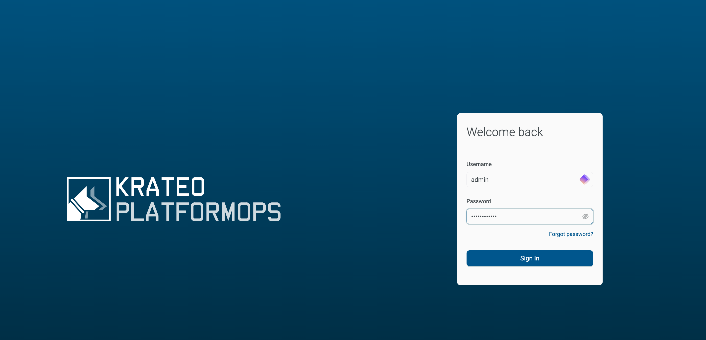
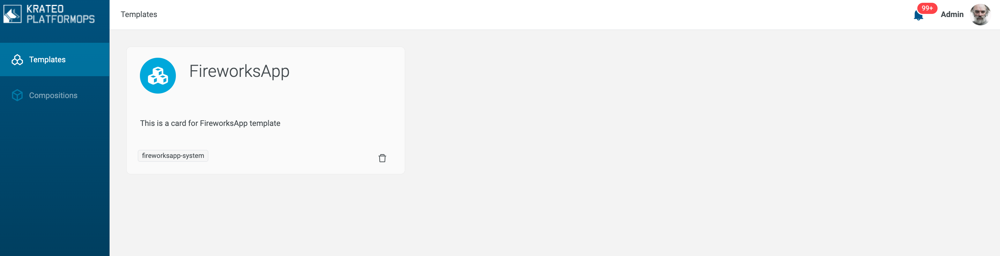
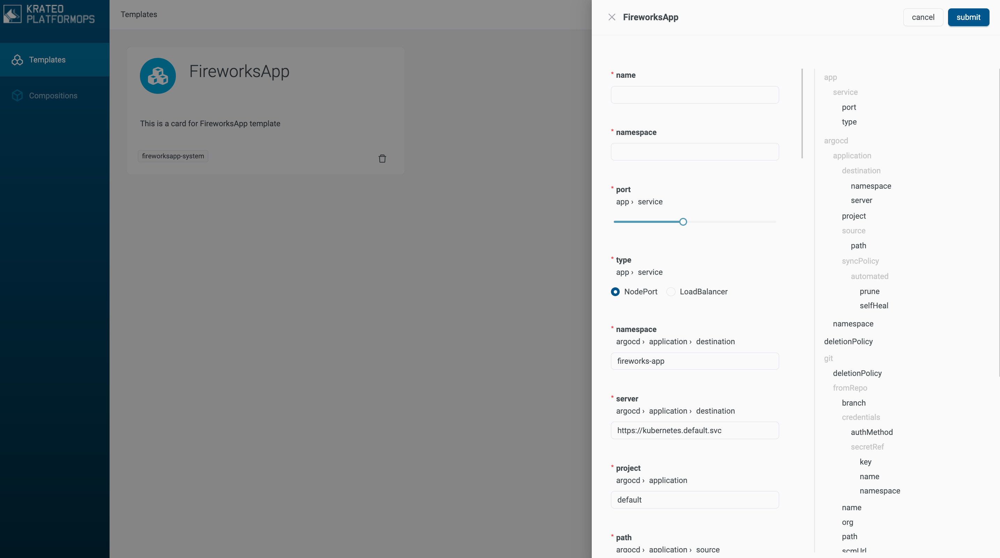
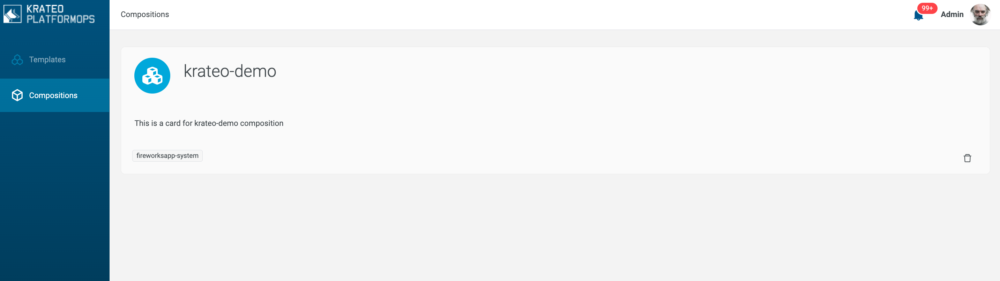
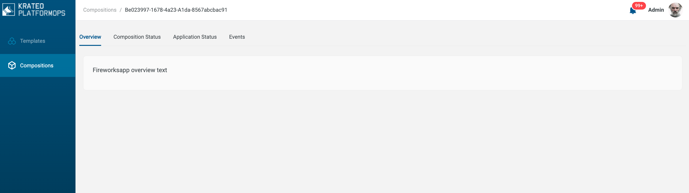
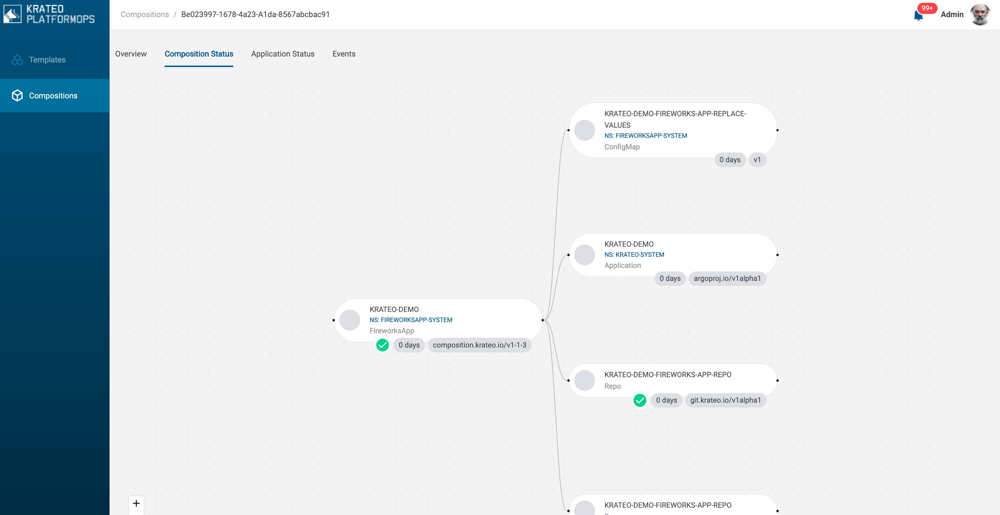
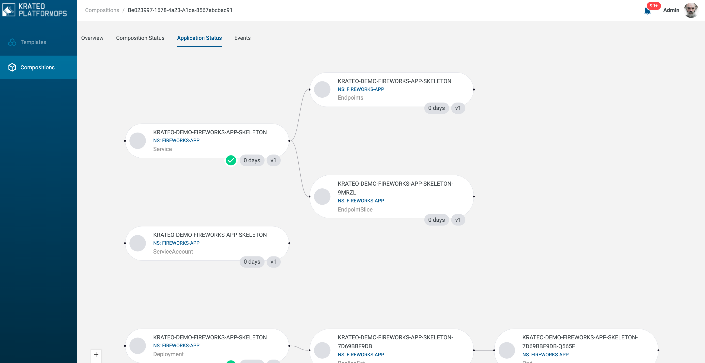
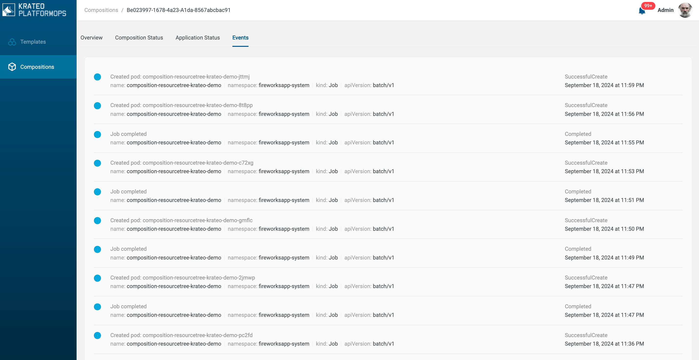

import Tabs from '@theme/Tabs';
import TabItem from '@theme/TabItem';

# Krateo PlatformOps Quickstart

This guide presents a basic introduction to Krateo PlatformOps. Together, we will:

* Install Krateo PlatformOps into a local or managed Kubernetes cluster.
* Deploy the FireworksApp Template
* Deploy a Composition leveraging the FireworksApp Template
* Destroy the cluster

## Requirements

The FireworksApp Template will create a new public GitHub repository in your organization. Fill the form according to the organization name.

## Deploy Krateo PlatformOps on a local cluster (kind)

Any of the following approaches require [Helm](https://helm.sh/docs/) v3.13.1 or
greater to be installed.

<Tabs groupId="local-cluster-start">
<TabItem value="kind" label="kind">

If you have any Docker-compatible container runtime installed (including native
Docker, Docker Desktop, or OrbStack), you can easily launch a disposable cluster
just for this quickstart using
[kind](https://kind.sigs.k8s.io/#installation-and-usage).

```shell
curl -L https://github.com/krateoplatformops/krateo-v2-docs/releases/latest/download/kind.sh | sh
```

:::info
While this option is a bit more complex than using Docker Desktop or OrbStack
directly, it offers the advantage of being fully-disposable. If your cluster
reaches a state you are dissatisfied with, you can simply destroy it and
launch a new one.
:::

Wait for Krateo PlatformOps to be up&running:
```shell
kubectl wait krateoplatformops krateo --for condition=Ready=True --namespace krateo-system --timeout=300s
```

At the end of this process:

* The *Krateo Composable Portal* will be accessible at [localhost:30080](http://localhost:30080).
* The *admin* user password can be retrieved with the following command:
```shell
kubectl get secret admin-password  -n krateo-system -o jsonpath="{.data.password}" | base64 -d
```
</TabItem>
</Tabs>

Login into the Krateo Composable Portal:



## Deploy the FireworksApp Template

We will leverage the [FireworksApp template](https://github.com/krateoplatformops/krateo-v2-template-fireworksapp).
Follow the [README](https://github.com/krateoplatformops/krateo-v2-template-fireworksapp/blob/main/README.md) instructions to deploy the template leveraging [Krateo Composable Portal](https://github.com/krateoplatformops/krateo-v2-template-fireworksapp/blob/main/README.md#with-krateo-composable-portal).

Wait for the *CompositionDefinition* to become Ready:
```shell
kubectl wait compositiondefinition fireworksapp --for condition=Ready=True --namespace fireworksapp-system --timeout=300s
```

Check the *Templates* section in the Portal:



## Deploy a Composition leveraging the FireworksApp Template

Click on the *FireworksApp* card, a form will appear on the right:



Fill the form fields in the following way:

| Key  | Value |
| ------------- | ------------- |
| name  | krateo-demo  |
| namespace  | fireworksapp-system  |
| namespace  | fireworksapp-system  |
| git.toRepo.org | *your github organization* |

A new Composition is now available:



Let's dig into the Composition tabs:

### Overview



### Composition Status



### Application Status



### Events



## Destroy the cluster

Simply destroy the cluster:

<Tabs groupId="local-cluster-start">
<TabItem value="kind" label="kind">

```shell
kind delete cluster --name krateo-quickstart
```

</TabItem>
</Tabs>
